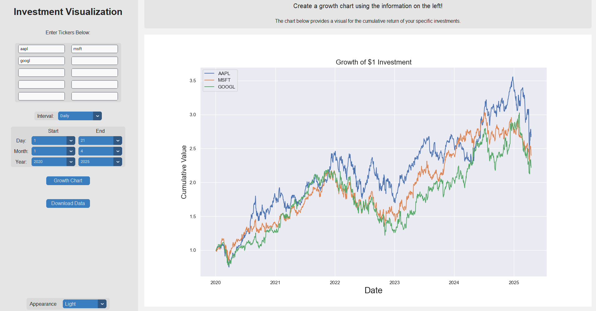

# InvestmentChart

A Python GUI application that visualizes the historical growth of investments over time using ticker symbols and a starting year. Built with `customtkinter`, `matplotlib`, and `yfinance`, this tool allows users to enter up to 10 tickers, choose a start and end date, and generate a growth chart. Users can also export the data as a `.csv` file.

## Preview

